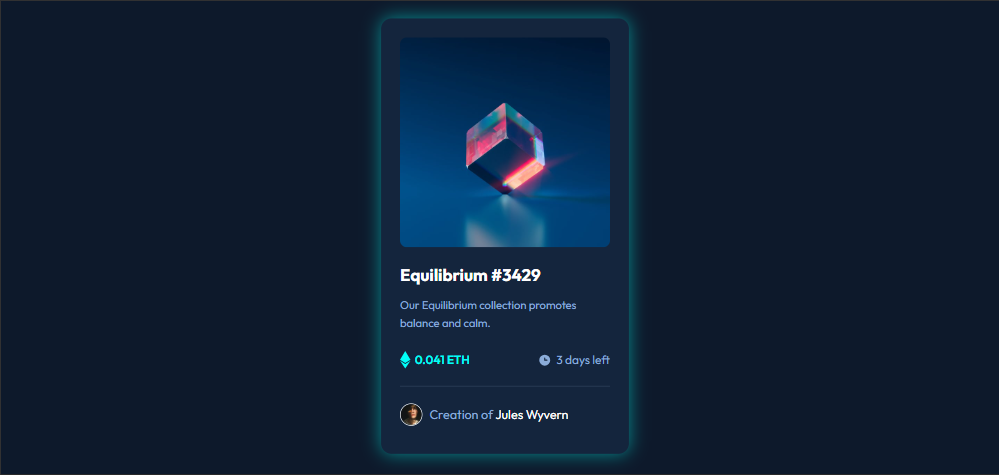

# NFT Preview Card Component

A responsive NFT card component built with **HTML** and **CSS**.  
The card features an NFT image with hover overlay, title, description, price, time left, and creator info.  
Designed mobile-first and enhanced for desktop.

---

## 📸 Screenshots

**Desktop View:**  
  

---

## 🔗 Links

- Solution URL: [Add solution URL here](https://your-solution-url.com)  
- Live Site URL: [Add live site URL here](https://your-live-site-url.com)

---

## 🛠️ Built With

- HTML5  
- CSS3 (Flexbox & Media Queries)  
- Google Fonts – Outfit  
- Mobile-first workflow  

---

## 🎯 What I Learned

- How to build a **mobile-first responsive layout**  
- How to create **hover overlay effects** without affecting image sharpness  
- How to implement **smooth hover transitions**  
- Proper **BEM-style class naming** for reusable components  

---

## 👤 Author

- Frontend Mentor – [@yourusername](https://www.frontendmentor.io/profile/yourusername)  
- Website – [Add your website link here](https://www.your-site.com)